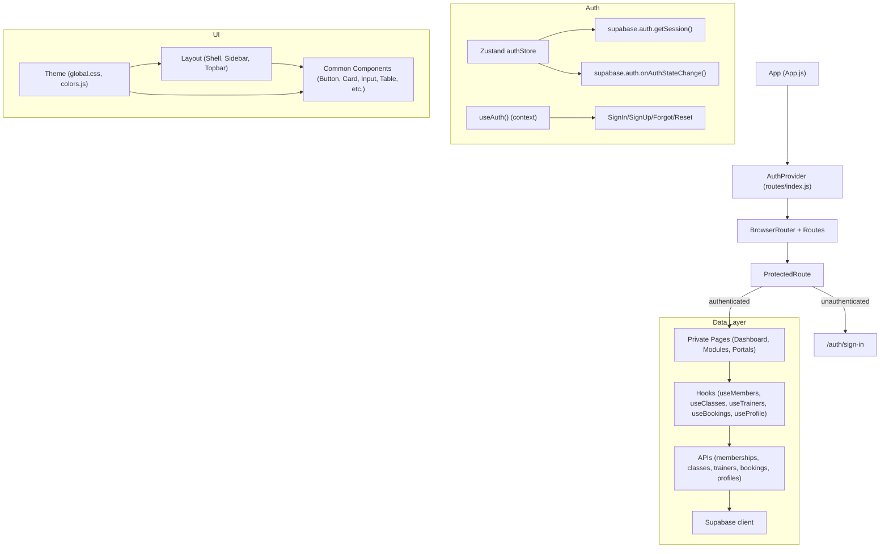

# Frontend Architecture

## Overview

The Gym Manager Frontend is a modern React application themed with the Ocean Professional design system. It integrates Supabase for authentication and data access, uses React Router v6 for routing with a ProtectedRoute guard, and manages client-side state with lightweight Zustand stores and feature-level hooks. The UI is composed of reusable components styled via CSS variables and utilities defined in the theme layer.

This document describes the project structure, theming, routing and guards, authentication/session flow, state management with Zustand, data layer using Supabase (APIs and hooks), portals and role-based routing, feature flagging, testing approach, and setup including environment variables.

## Project Structure

The source tree emphasizes separation of concerns:

- src/
  - App.js: Application root routing and protected sections
  - routes/
    - index.js: AuthProvider, useAuth, ProtectedRoute
  - lib/
    - supabaseClient.js: Supabase client singleton (reads env)
  - store/ (Zustand)
    - authStore.js: Supabase-backed auth/session state and actions
    - uiStore.js: UI toggles and toasts
    - membershipsStore.js, classesStore.js, trainersStore.js, bookingsStore.js: simple scaffolds
  - data/ (Supabase data access layer)
    - membershipsApi.js, classesApi.js, trainersApi.js, bookingsApi.js, profilesApi.js
    - __tests__/membershipsApi.test.js
  - hooks/ (Feature hooks over the data layer)
    - useMembers.js, useClasses.js, useTrainers.js, useBookings.js, useProfile.js
  - components/
    - common/: Button, Card, DataTable, Input, Select, Snackbar, Loader, Badge, StatsGrid, Table
    - layout/: Shell, Sidebar, Topbar
    - portals/member/: MyMembership, MyBookings, MySchedule
    - portals/trainer/: MyClasses, AttendanceList
  - pages/
    - Dashboard.jsx, Memberships.jsx, Classes.jsx, Trainers.jsx, Bookings.jsx, Settings.jsx
    - auth/: SignIn.jsx, SignUp.jsx, ForgotPassword.jsx, ResetPassword.jsx
    - portals/: MemberPortal.jsx, TrainerPortal.jsx, RoleRedirect.jsx
  - config/
    - features.js: Central feature flags with env overrides
  - theme/
    - colors.js, global.css (CSS variables, utilities, components’ base styling)
  - __tests__/
    - auth.test.jsx, routing.test.jsx
  - testUtils/
    - renderWithProviders.jsx, supabaseMock.js
  - index.js, index.css, App.css, setupTests.js

## Theming (Ocean Professional)

The Ocean Professional theme is codified through CSS variables and utilities:

- src/theme/global.css defines the theme tokens:
  - Color palette variables: --color-primary, --color-secondary, --color-success, --color-error, surface/background text and border colors.
  - Radius, spacing, shadow, transition tokens, and a subtle gradient preset.
  - Base styles and utility classes (container, text-muted, card-surface, app-gradient, table, modal, snackbar, spinner).
- src/theme/colors.js exposes the palette for any JS-based styling needs via getThemeColors.
- Components in src/components/common consume these variables to render consistent visuals:
  - Button.jsx, Input.jsx, Select.jsx, Card.jsx, Badge.jsx, Snackbar.jsx, Loader.jsx, StatsGrid.jsx, Table.jsx.
- The layout components (Shell, Sidebar, Topbar) compose the application shell with a left navigation, a sticky topbar, and a content container. The look-and-feel comes from global.css and inline styles referencing CSS variables.

Key theme goals:
- Minimal dependencies: styling via CSS variables and simple inline styles.
- Consistency: shared tokens enforce consistent spacing, radii, and shadows.
- Responsiveness: container widths and responsive helpers in global.css.

## Routing and ProtectedRoute

Routing is configured in src/App.js using react-router-dom v6:

- Public routes:
  - /auth/sign-in, /auth/sign-up, /auth/forgot-password, /auth/reset-password.
- Protected routes:
  - Wrapped in ProtectedRoute: /, /memberships, /classes, /trainers, /bookings, /settings, /portal, /portal/member, /portal/trainer.

AuthProvider and ProtectedRoute are defined in src/routes/index.js:
- AuthProvider hydrates auth state from the Zustand authStore and exposes methods for sign-in/up, password reset, update password, and sign-out.
- ProtectedRoute uses useAuth to check authentication:
  - While loading, a minimal inline loader is shown.
  - If unauthenticated, it redirects to /auth/sign-in and passes a redirect param with the original intended path.
  - If authenticated, it renders an Outlet for nested protected routes.

This guard ensures non-authenticated users cannot access private pages, and after successful sign-in, users are redirected to their intended location.

## Supabase Auth/Session Flow

Supabase integration lives in:
- src/lib/supabaseClient.js: A single Supabase client created with REACT_APP_SUPABASE_URL and REACT_APP_SUPABASE_KEY. Warnings are logged in development if env vars are not set.
- src/store/authStore.js: Zustand store that:
  - Initializes by calling supabase.auth.getSession to populate session/user.
  - Subscribes to supabase.auth.onAuthStateChange to keep state in sync (session, user, profile, isAuthenticated, loading).
  - Exposes actions:
    - signInWithPassword(email, password): supabase.auth.signInWithPassword
    - signUpWithPassword(email, password, emailRedirectTo): supabase.auth.signUp with email verification
    - sendPasswordReset(email, redirectTo): supabase.auth.resetPasswordForEmail
    - updatePassword(newPassword): supabase.auth.updateUser
    - signOut(): supabase.auth.signOut (and clears local store state)
- src/routes/index.js: AuthProvider mirrors store state into React context to provide useAuth() across the app and route auth calls back to the store. This maintains a single source of truth for session and user data.

Password flows:
- ForgotPassword.jsx triggers reset emails using sendPasswordReset with a redirect to /auth/reset-password.
- ResetPassword.jsx calls updatePassword to finalize a password change during a password recovery session.

## State Management with Zustand

Zustand is used for focused state slices:

- Auth state: src/store/authStore.js
  - Holds session, user, profile, isAuthenticated, loading, and exposes auth methods.
  - Initializes and listens to Supabase auth changes.
- UI state: src/store/uiStore.js
  - Manages sidebar visibility, theme mode (scaffold), and toasts.
  - Provides toggleSidebar, setSidebarOpen, setTheme, and simple toast helpers.
- Domain scaffolds: src/store/membershipsStore.js, classesStore.js, trainersStore.js, bookingsStore.js
  - Basic structure for items/loading/error and setters.
  - Feature hooks currently coordinate data fetching and CRUD, while stores can retain shared UI or cross-component states if needed.

In practice, feature hooks (useMembers, useClasses, useTrainers, useBookings) encapsulate data loading, pagination, and CRUD via the data layer (APIs) and expose declarative interfaces to pages and components. Zustand stores remain lean and are available to persist UI state or to centralize shared domain states as the app grows.

## Data Layer Using Supabase (APIs and Hooks)

The data access layer is organized by table in src/data/ and uses the supabase client to perform CRUD with RLS in mind:

- membershipsApi.js, classesApi.js, trainersApi.js, bookingsApi.js:
  - list({ limit, offset, orderBy, ascending, filters }): supports pagination via range, ordering, and simple equality filters, returns { data, error, count } with count="exact".
  - getById(id): fetches a single row using .single().
  - create(payload): .insert(payload).select().single()
  - update(id, patch): .update(patch).eq('id', id).select().single()
  - remove(id): .delete().eq('id', id)
- profilesApi.js:
  - getCurrentProfile(): uses supabase.auth.getUser() then fetches the user row from profiles by id.
  - upsertProfile(patch): upserts the current user's profile row.

Feature hooks in src/hooks/ wrap API calls with React state:

- useMembers, useClasses, useTrainers, useBookings:
  - Manage loading, error, pagination, and call their respective APIs.
  - Expose a unified interface: { data, loading, error, page, pageSize, total, setPage, refresh, create, update, remove }.
- useProfile:
  - Loads the current user profile via profilesApi.
  - Exposes refresh and save (upsert).

This approach keeps pages and components declarative while encapsulating Supabase-specific details within APIs and hooks.

## Member and Trainer Portals, Role-Based Routing

Portals are implemented in src/pages/portals:

- RoleRedirect.jsx:
  - Reads the current profile role (via useProfile), then navigates:
    - trainer -> /portal/trainer
    - member -> /portal/member
    - admin or unknown -> / (dashboard)
- MemberPortal.jsx:
  - Personalized member view showing My Schedule, My Bookings, and membership info.
  - Uses useClasses and useBookings to display lists and creates/cancels bookings with simple placeholder flows.
- TrainerPortal.jsx:
  - Trainer view showing My Classes and Attendance List.
  - Uses useClasses and useBookings and allows marking attendance by updating booking status.

The Sidebar also adapts its visible menu items based on role (from useProfile), surfacing only the relevant modules for admins, trainers, or members.

## Feature Flags

Feature flags are centralized in src/config/features.js:

- defaults define which modules are on by default.
- envFlag reads REACT_APP_FEATURE_<NAME> variables to override defaults at build time.
- features exports normalized booleans for these keys:
  - dashboard, memberships, classes, trainers, bookings, memberPortal, trainerPortal
- isFeatureEnabled(name) returns a boolean for convenience.

Usage: import { features } from '../config/features' and conditionally render modules. Example:
- features.memberships && <Memberships />

Environment overrides accept true/false values in common string forms: "true", "false", "1", "0", "yes", "no", "on", "off".

## Testing Approach

The project includes unit and integration tests focused on auth routing and the data layer:

- src/__tests__/auth.test.jsx:
  - Verifies that SignIn honors redirect flow upon successful sign-in using a mocked AuthContext.
- src/__tests__/routing.test.jsx:
  - Verifies ProtectedRoute redirects unauthenticated users to /auth/sign-in with a redirect param.
  - Verifies ProtectedRoute renders children for authenticated state.

Data layer testing:
- src/data/__tests__/membershipsApi.test.js:
  - Tests list/getById/create/update/remove behaviors against a deterministic Supabase mock.

Testing utilities:
- src/testUtils/supabaseMock.js:
  - A minimal chainable query builder to simulate supabase.from(table) queries including .select, .eq, .order, .range, .single, .maybeSingle, .insert, .update, and .delete.
  - Includes a subset of supabase.auth methods used by the app for tests.
- src/testUtils/renderWithProviders.jsx:
  - Provides a wrapper with AuthProvider and MemoryRouter for tests requiring routing and auth context.

Run tests:
- npm test (non-watch)
- npm run test:ci (CI=true non-interactive)

## Pages and Modules

- Dashboard.jsx: KPIs via StatsGrid and latest tables for classes and bookings.
- Memberships.jsx, Classes.jsx, Trainers.jsx, Bookings.jsx:
  - List views with search, inline create/edit modals, pagination, and refresh.
- Settings.jsx: Organization settings and a profile section placeholder.
- Auth pages:
  - SignIn.jsx: Email/password sign-in, redirects to intended URL via redirect query param.
  - SignUp.jsx: Email/password sign-up with email verification.
  - ForgotPassword.jsx: Sends reset email with redirect to /auth/reset-password.
  - ResetPassword.jsx: Updates password and navigates to sign-in.

All protected routes are wrapped by ProtectedRoute, ensuring only authenticated users access them.

## Setup and Environment Variables

Prerequisites:
- Node.js and npm
- Supabase project with anon key and URL

Install:
- npm install

Environment:
- Copy .env.example to .env and set:
  - REACT_APP_SUPABASE_URL
  - REACT_APP_SUPABASE_KEY
- Optional feature flag overrides:
  - REACT_APP_FEATURE_DASHBOARD
  - REACT_APP_FEATURE_MEMBERSHIPS
  - REACT_APP_FEATURE_CLASSES
  - REACT_APP_FEATURE_TRAINERS
  - REACT_APP_FEATURE_BOOKINGS
  - REACT_APP_FEATURE_MEMBERPORTAL
  - REACT_APP_FEATURE_TRAINERPORTAL

Notes:
- Create React App only exposes variables prefixed with REACT_APP_.
- Do not commit sensitive values; use .env and keep .env.example as a template.

Run:
- npm start (http://localhost:3000)

Build:
- npm run build

Lint/Format:
- npm run lint
- npm run format

Tests:
- npm test
- npm run test:ci

## High-Level Flow Diagram

## Role-Based Navigation

- Sidebar.jsx reads the user's role from useProfile and filters navigation items accordingly:
  - admin: dashboard, memberships, classes, trainers, bookings, settings
  - trainer: dashboard, classes, settings, trainer portal
  - member: dashboard, settings, member portal

RoleRedirect.jsx consolidates the routing decision when navigating to /portal.

## Extensibility Notes

- Domain stores (e.g., membershipsStore) are available to migrate or centralize state beyond what the hooks provide if cross-component synchronization grows complex.
- profilesApi can be extended to include more profile fields; authStore.fetchProfile is scaffolded to wire profile syncing if needed.
- Feature flags enable phased rollouts and conditional rendering. Consider augmenting them with remote config if dynamic toggling is needed.
- The theme system can be extended with dark mode by toggling data-theme attributes and expanding CSS variables accordingly.

## Troubleshooting

- If Supabase env vars are missing, supabaseClient.js logs a warning. Ensure both REACT_APP_SUPABASE_URL and REACT_APP_SUPABASE_KEY are set before running or building.
- Authentication issues:
  - Verify the Supabase URL/key and that email/password auth is enabled in Supabase.
  - Check redirect URLs configured in Supabase Auth settings to include your local and production URLs.
- If feature toggles do not reflect, confirm the env values are set before the build and follow the REACT_APP_FEATURE_<NAME> naming.

